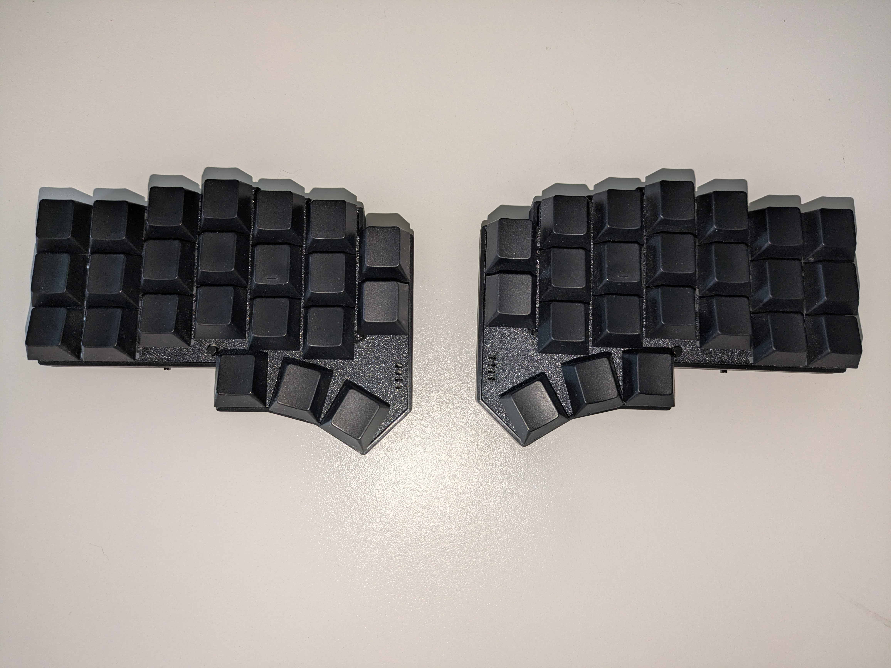
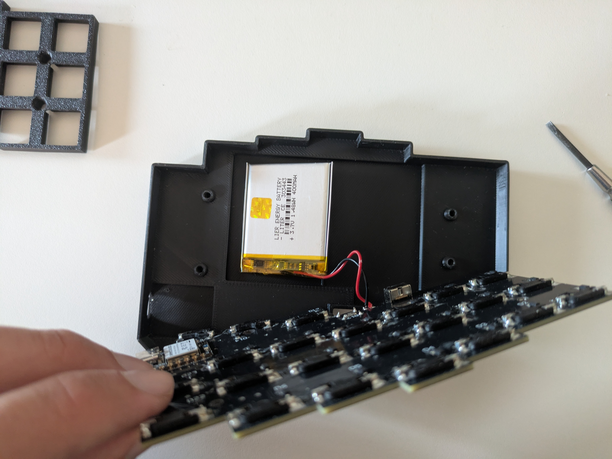
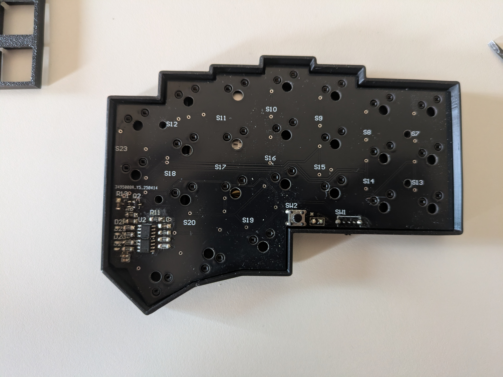
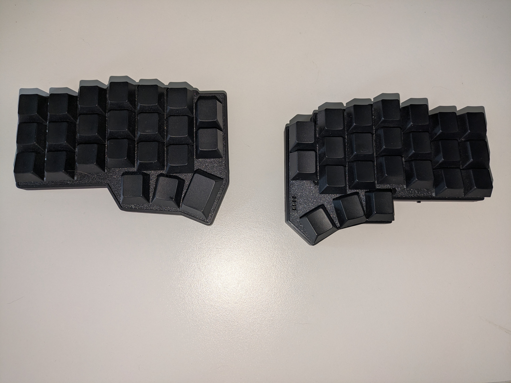

# XiaoCorne (Bluetooth)

A compact, wireless keyboard inspired by the Corne v4 (foostan/crkbd), rebuilt around a Seeed XIAO BLE.
My goal was to create a wireless keyboard without any visible microcontroller and to minimize unused space.
For reading the battery level, a fully analog indicator with 4 LEDs is on the top side of the PCB.

Firmware and ZMK config are here: https://github.com/FabianAster/seedCorneModule

I made the PCB with CircuitMaker, not with KiCad, so I can only share the link to it: https://workspace.circuitmaker.com/Projects/Details/9C26B9D0-BD64-4451-B20A-DC635F824EC1
Gerber files to order the PCB are in the repo.

## Some More Images

### PCB Bottom and Battery

For the case to fit, it needs to be a 10345 LiPo battery. Charging is handled by the Seeeduino XIAO BLE.
The LEDs on the top side need to be red, since I used simple 358 op-amps for voltage comparison, and they drop some voltage at their output.

### PCB Top

### Comparison with Original Corne V4 on the Left, This One on the Right

## Part List

| Quantity | Part                      | Package/Type |
| -------- | ------------------------- | ------------ |
| 4        | 100nF capacitor           | 0603         |
| 4        | AO3401A MOSFET            | SOT-23       |
| 1        | Switch (SK12D07VG4NSPA)   | -            |
| 46       | Hotswap MX sockets        | -            |
| 46       | SMD Diode (1N4007L)       | SOD-123      |
| 2        | Seeed Xiao BLE (nRF52840) | -            |
| 2        | LM358 SMD                 | SOIC-8       |
| 1        | Button                    | -            |
| 4        | Red LED                   | 0603         |
| 1        | 4.7k Ohm resistor         | 1206         |
| 3        | 10k Ohm resistor          | 1206         |
| 1        | 130 Ohm resistor          | 1206         |
| 1        | 220 Ohm resistor          | 1206         |
| 1        | 180 Ohm resistor          | 1206         |
| 1        | 3.6k Ohm resistor         | 1206         |
